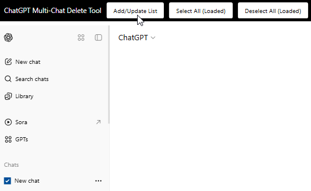
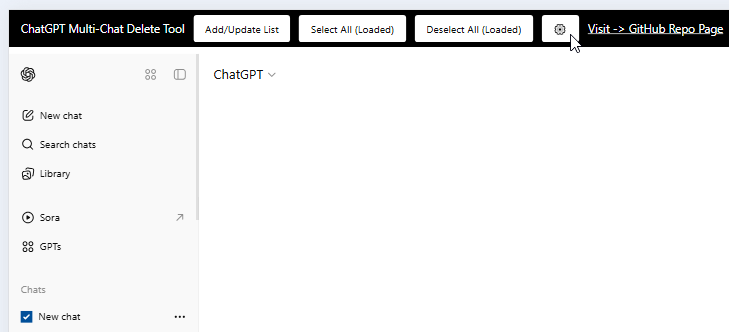
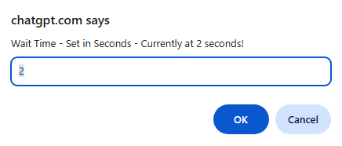
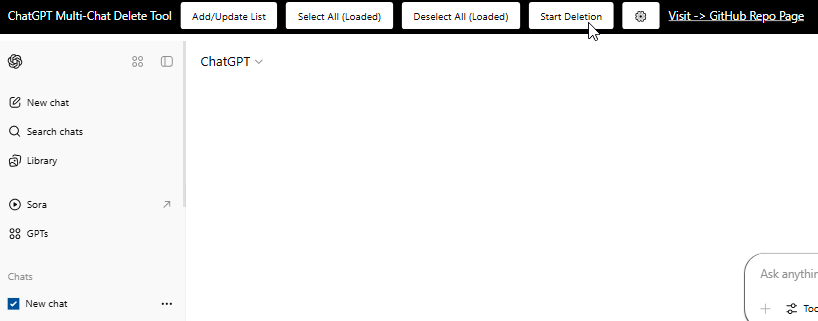
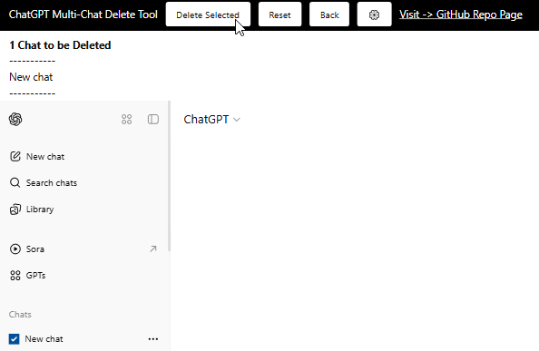

# ChatGPT Multi-Chat Delete Tool 1.1.0

ChatGPT's UI forces you to delete chats one by one, but this script allows you to batch delete chats with ease.

Currently, this only works on chatgpt.com. If you would like automatic detection for different hosts, please make a request.

**⚠️ CAUTION:**
Use at your own risk!

## How to Use

To use this script, you'll need Tampermonkey: https://www.tampermonkey.net/

### 1. Adding and Removing Items

Select any chat you want to add to the batch by checking the checkbox to the left of the item, then click the **Add/Update List** button. The UI will display a temporary message showing how many items were added, removed, and the total.

You can also click the **Select All (Loaded)** and **Deselect All (Loaded)** buttons for mass selection or deselection. The (Loaded) part means it will only select or deselect elements which have been loaded in on the client side. Scrolling down the page will load more chat items if they exist.

### 2. Changing the Click Speed

You can edit how fast the click function works (in seconds) by clicking the **⚙️** button. The default is set to two seconds.

  

### 3. Deleting Items

Once you're ready to delete, click the **Start Deletion** button. A log will display at the top left under the UI, showing the actual items in the queue.  
- Click **Reset** to clear the list and return to the initial state.  
- Click **Back** to make changes.  
- To proceed, click **Delete Selected**, but before doing so you can press F12 and check the console to be sure the items set for deletion are correct.

**IMPORTANT:**
Keep the window and tab in focus during the delete operation.

Once done, an alert box will pop up confirming the operation has been completed.

## Terms of Use
By using this script, you agree to take full responsibility for any side effects or consequences that may arise from its use.